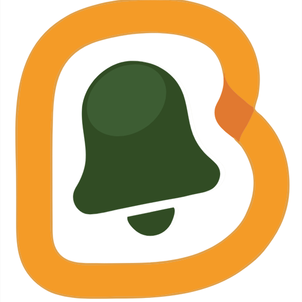
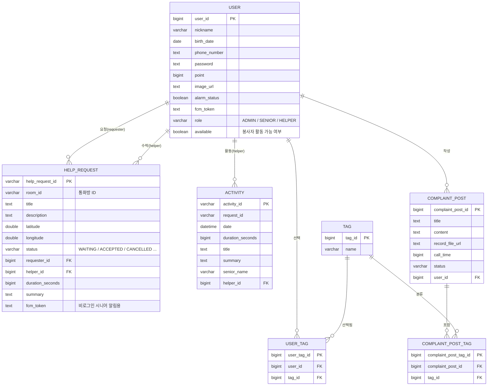
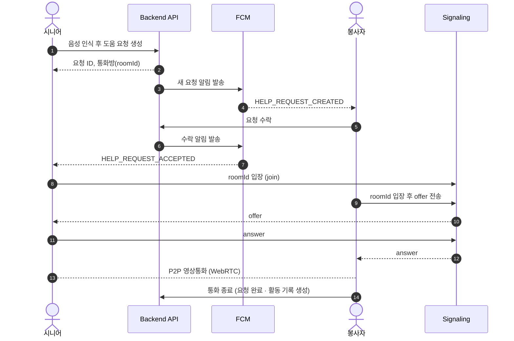

<div align="center">



# Beeper (삐삐)

**"도움이 필요할 때, 말 한마디로 간편하게"**

음성 한 번으로 도움을 요청하고, 봉사자와 영상통화로 바로 연결되는 실시간 도움 매칭 서비스

</div>

<br />

## 목차

1. [프로젝트 소개](#1-프로젝트-소개)
2. [기획 배경](#2-기획-배경)
3. [시연 화면 및 설명](#3-시연-화면-및-설명)
4. [설계](#4-설계)
5. [기술](#5-기술)

<br />

---

## 1. 프로젝트 소개

### 소개글

**Beeper(삐삐)**는 일상에서 어려움을 겪는 디지털 취약계층 및 노약자가 **말 한마디로 도움을 요청**하고, 실시간으로 **봉사자가 요청을 수락해 영상통화로 바로 연결**되는 서비스입니다.


### 배포 환경

| 구분 | 환경 | 비고 |
| :---: | :--- | :--- |
| **Frontend** | Flutter (Web / Android) | 배포 플랫폼 기입 예정 |
| **Backend** | Spring Boot 3.3 / Java 21 | AWS EC2 |
| **Database** | MySQL | - |

### 팀 정보


<div>

| **문지혜** | **이기정** | **이주현** | **정은혁** |
| :------: |  :------: | :------: | :------: |
| [ <br/> @Jihye Moon](https://github.com/Dev-JihyeMoon) | [ <br/> @이기정](https://github.com/a8534751) | [ <br/> @ImitationProgramer](https://github.com/ImitationProgramer) | [ <br/> @EunHyeokJung](https://github.com/EunHyeokJung) |

</div>

<br />

---

## 2. 기획 배경

### 기획 의도

디지털 취약계층 및 노약자는 일상에서 작은 문제(스마트 예매 서비스, 무인 발권 및 구매, 온라인 서비스 이용 등)를 **누구에게, 어떻게 물어봐야 할지 몰라** 도움을 받지 못하는 경우가 많습니다. 반대로 시간을 내어 봉사하고 싶은 사람은 있어도, **필요한 순간에 필요한 사람과 연결해 주는 통로**가 부족합니다.

- 디지털 취약계층 및 노약자에게는 **회원가입, 로그인, 글쓰기** 같은 절차 자체가 큰 장벽입니다.
- 도움이 필요한 순간과 도울 수 있는 순간이 **실시간으로 맞물리지 않으면** 요청은 방치됩니다.
- 글이나 채팅보다 **얼굴을 보며 말로 설명**하는 방식이 훨씬 빠르고 즉각적으로 대응할 수 있습니다.

### 도달한 솔루션

> **"말하면 요청이 되고, 수락되면 바로 통화가 된다"**

| 문제 | Beeper의 해결 방식 |
| :--- | :--- |
| 복잡한 입력과 가입 절차 | **음성 인식**으로 요청을 작성하고, **로그인 없이** 바로 요청 |
| 도움 요청이 전달되지 않음 | 요청 생성 즉시 **푸시 알림(FCM)** 으로 봉사자에게 실시간 전달 |
| 글로 설명하기 어려움 | 수락 즉시 **WebRTC 영상통화**로 연결해 얼굴을 보며 해결 |
| 봉사 활동 관리의 어려움 | 통화 종료 시 **활동 내역이 자동 기록** |

### 핵심 기능

| 기능 | 설명 |
| :--- | :--- |
| 🎙️ **음성 도움 요청** | 음성 인식(STT)으로 요청 내용을 작성하고, 전송 전에 내용을 확인·수정 |
| 🔔 **실시간 요청 알림** | 새 요청이 생성되면 봉사자에게 푸시 알림을 전송하고, 목록을 자동 갱신 |
| 📹 **영상통화 연결** | 요청 수락 시 WebRTC(P2P) 영상통화로 즉시 연결, WebSocket 시그널링 사용 |
| 📋 **활동 내역 관리** | 통화 종료 시 활동 기록을 자동 생성하고, 목록·상세 조회 제공 |
| 🏷️ **알림 태그 · 활동 상태** | 관심 태그 설정, 활동 가능/중지 전환으로 알림 수신 범위 조절 |
| 👤 **프로필 관리** | 닉네임, 전화번호, 생년월일, 비밀번호 수정 |

<br />

---

## 3. 시연 화면 및 설명 (GIF 이미지 첨부 예정)

> 📺 **전체 시연 영상**: [YouTube 링크 첨부 예정](https://www.youtube.com)

<br />

### 🎙️ 음성으로 도움 요청하기

<table>
  <tr>
    <td align="center" width="50%"><b>음성 인식</b></td>
    <td align="center" width="50%"><b>내용 확인 · 수정 후 요청</b></td>
  </tr>
  <tr>
    <td align="center"></td>
    <td align="center"></td>
  </tr>
</table>

마이크 버튼을 누르고 말하면 실시간으로 텍스트가 표시됩니다. 인식이 끝나면 요청 내용을 확인하고, 잘못 인식된 부분은 **직접 수정한 뒤** 요청을 보낼 수 있습니다.

<br />

### 🔔 요청 알림 받고 수락하기

<table>
  <tr>
    <td align="center" width="50%"><b>푸시 알림 · 요청 목록</b></td>
    <td align="center" width="50%"><b>요청 상세 · 수락</b></td>
  </tr>
  <tr>
    <td align="center"></td>
    <td align="center"></td>
  </tr>
</table>

새 도움 요청이 생성되면 푸시 알림이 도착하고 대기 목록이 자동으로 갱신됩니다. 요청 내용을 확인한 뒤 **수락**하면 바로 통화 화면으로 이동하며, 이미 마감된 요청은 안내 문구가 표시됩니다.

<br />

### 📹 영상통화로 도움 제공하기

<table>
  <tr>
    <td align="center" width="50%"><b>시니어 화면</b></td>
    <td align="center" width="50%"><b>봉사자 화면</b></td>
  </tr>
  <tr>
    <td align="center"></td>
    <td align="center"></td>
  </tr>
</table>

수락과 동시에 두 사용자가 WebRTC로 연결됩니다. 시니어 화면은 **큰 버튼과 큰 글씨**로 구성해 조작 부담을 줄였고, 마이크·카메라 전환과 통화 종료를 지원합니다.

<br />

### 📋 활동 내역과 프로필 관리

<table>
  <tr>
    <td align="center" width="50%"><b>활동 내역</b></td>
    <td align="center" width="50%"><b>프로필 · 알림 태그</b></td>
  </tr>
  <tr>
    <td align="center"></td>
    <td align="center"></td>
  </tr>
</table>

통화가 끝나면 활동 기록이 자동으로 생성되어 **날짜, 통화 시간, 요약, 태그**를 확인할 수 있습니다. 프로필과 알림 태그도 한 화면에서 수정할 수 있습니다.

<br />

---

## 4. 설계

### 인프라 구조

> 인프라 구조도 이미지 첨부 예정

<div align="center">
  
</div>

<br />

### ERD



> 모든 테이블은 `created_at`, `updated_at` 컬럼을 공통으로 가집니다.

<br />

### 서비스 구조

**시스템 구성**
(이미지 첨부 예정)


**도움 요청 ~ 통화 흐름**



**백엔드 패키지 구조**

```
backend/src/main/java/com/lastdance/beeper/
├── controller/    # REST API 진입점 (인증, 사용자, 도움 요청, 태그, 활동, FCM)
├── service/       # 비즈니스 로직 (impl 포함)
├── data/
│   ├── domain/    # JPA 엔티티
│   ├── dto/       # 요청/응답 DTO
│   ├── repository/
│   └── util/      # Enum (Role, HelpRequestStatus, Status)
├── config/        # Security(JWT), WebSocket, Firebase, Swagger, JPA 설정
├── Socket/        # WebRTC 시그널링 WebSocket 핸들러
└── common/        # 공통 응답 코드
```


<br />

---

## 5. 기술

### 기술 스택

<table>
  <tr>
    <td align="center" width="120"><b>Frontend</b></td>
    <td>
      
      
      
      
      
    </td>
  </tr>
  <tr>
    <td align="center"><b>Backend</b></td>
    <td>
      
      
      
      
      
      
      
    </td>
  </tr>
  <tr>
    <td align="center"><b>Database</b></td>
    <td>
      
      
    </td>
  </tr>
  <tr>
    <td align="center"><b>Realtime</b></td>
    <td>
      
      
      
      
    </td>
  </tr>
  <tr>
    <td align="center"><b>Infra / Tool</b></td>
    <td>
      
      
    </td>
  </tr>
</table>

### 기술 고민 포인트

각 파트에서 마주한 문제와 해결 과정은 아래 문서에서 자세히 확인할 수 있습니다.

| 파트 | 문서 |
| :---: | :--- |
| 🖥️ **Backend** | [Backend README 바로가기(작성중)](./backend/README.md) |
| 📱 **Frontend** | [Frontend README 바로가기(작성중)](./frontend/README.md) |
